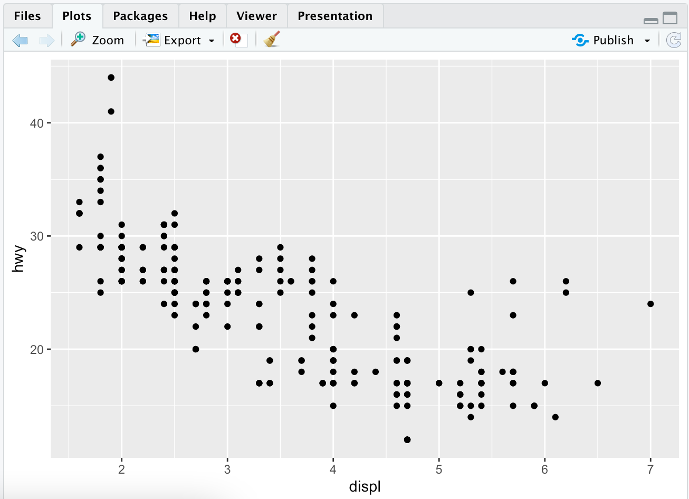
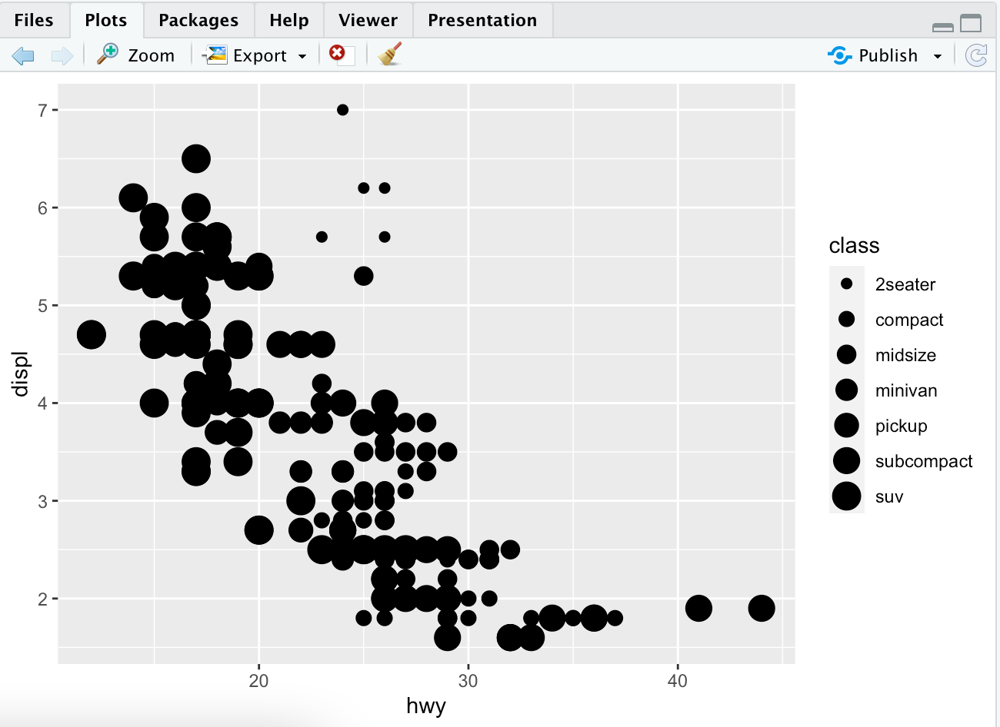
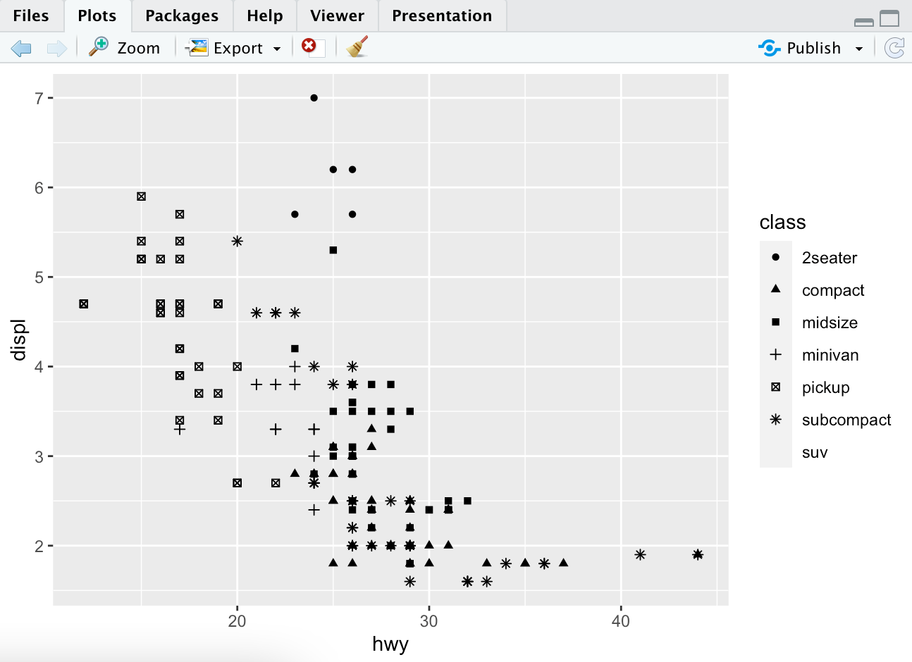
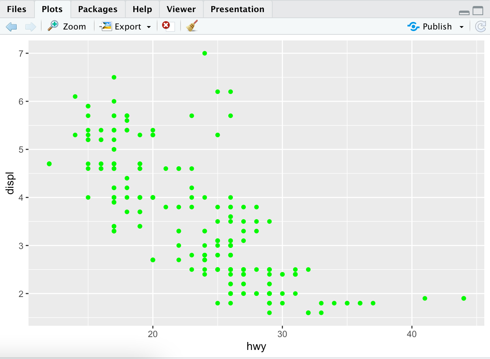
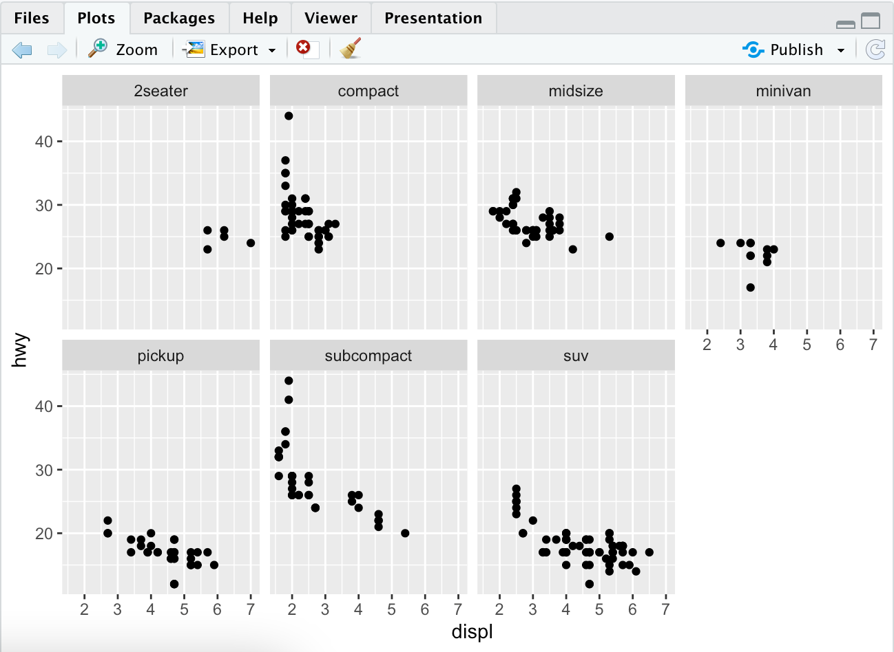
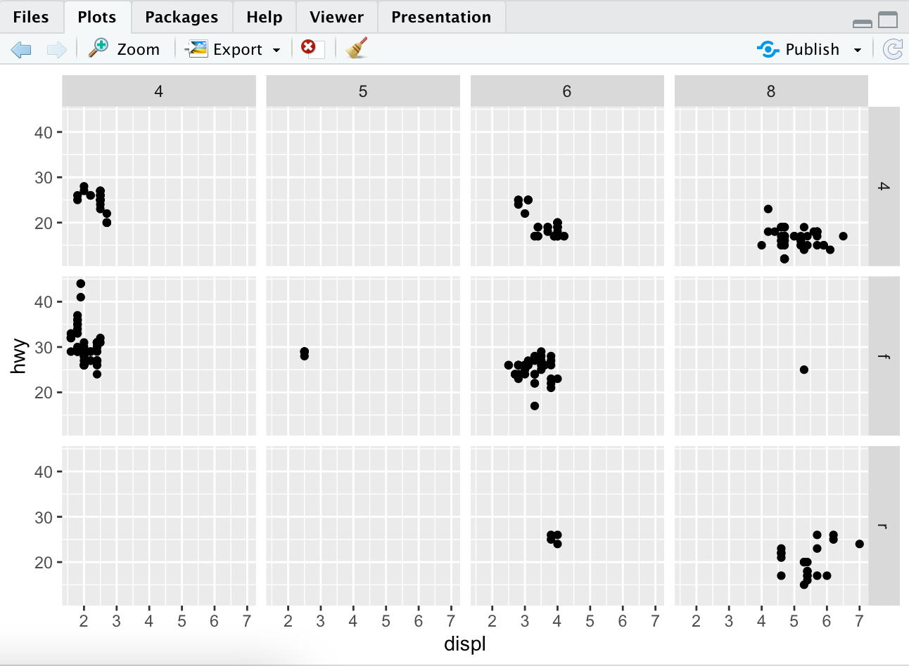

# Data Visualisation

## Introduction

Learn how to visualise data with ggplot2. R has several systems for making graphs, but ggplot2 is the most elegant and versatile. ggplot2 implements the **grammar of graphics**, which is a coherent system for describing and building graphs.

You need to first make sure that you have tidyverse as described in the first page introduction. To do this again you use the line,

```R
install.packages("tidyverse")
```

## Let's Begin

I've got a question... Do cars with big engines use more fuel than cars with small engines? What does the relationship between engine size and fuel efficiency look like?

### _mpg_ Data Frame

This answer can be tested with the _mpg_ data frame found in ggplot2. This is done with `ggplot2::mpg`.

> What is a data frame? A data frame is a rectangular collection of variables (columns) and observations (rows).

This _mpg_ data containts observations collected by the US Environmental Protection Agency on 38 models of cars.

This is what your I/O will look like. This uses `mpg` as your input.

```R
> mpg
# A tibble: 234 × 11
   manufacturer model      displ  year   cyl trans      drv     cty   hwy fl    class
   <chr>        <chr>      <dbl> <int> <int> <chr>      <chr> <int> <int> <chr> <chr>
 1 audi         a4           1.8  1999     4 auto(l5)   f        18    29 p     compact
 2 audi         a4           1.8  1999     4 manual(m5) f        21    29 p     compact
 3 audi         a4           2    2008     4 manual(m6) f        20    31 p     compact
 4 audi         a4           2    2008     4 auto(av)   f        21    30 p     compact
 5 audi         a4           2.8  1999     6 auto(l5)   f        16    26 p     compact
 6 audi         a4           2.8  1999     6 manual(m5) f        18    26 p     compact
 7 audi         a4           3.1  2008     6 auto(av)   f        18    27 p     compact
 8 audi         a4 quattro   1.8  1999     4 manual(m5) 4        18    26 p     compact
 9 audi         a4 quattro   1.8  1999     4 auto(l5)   4        16    25 p     compact
10 audi         a4 quattro   2    2008     4 manual(m6) 4        20    28 p     compact
# … with 224 more rows
```

The general variables found in this chart containts

1. `displ`, which is the car's engine size in litres
2. `hwy`, which is a car's fuel efficiency on the highway, in miles per gallon. A car with low fuel efficiency will consume more gas than are car with better fuel efficiency.

### Creating a ggplot

To plot mpg, you can run the same code and put `dipl` on the x-axis and `hwy` on the y-axis.

```R
ggplot(data = mpg) +
    geom_point(mapping = aes(x = displ, y = hwy))
```

This will result in a plot that looks something like this.



From this data we can easily see a negative relationship between engine size and fuel efficiency. In other words this means that cars with larger engines use more fuel in a shorter amount of time than smaller cars.

`ggplot()` creates a coordinate system that you can add layers to. The first argument of `ggplot()` is the dataset to use in the graph. This means that our first argument `ggplot(data = mpg)` created an empty graph.

Using `geom_point()` adds layers of points to the plot creating a scatter plot. Each geometry function with ggplot2 takes a mapping argument. This defines how variables in the dataset are mapped to visual properties. The mapping argument is always paired with `aes` and the x/y arguments of `aes()`.

### Graphing Template

The template for graphing something in R is ->

```R
ggplot(data = <DATA>) +
    <GEOM_FUNC>(mapping = aes(<MAPPINGS>))
```

Try comparing `hwy` and `cyl`. What do you see? What does this data mean? Does having more cylinders mean worse highway mileage.

## Aesthetic Mappings

In a plot, what do we do when we have outliers that are way out from where the normal data is?


You can hypothesize what these cars are. They are most likely going to be hybrid cars and that sounds like a reasonable explanation. The cars are classified by the mpg dataset as subcompact, minivan, midsize, 2seater and pickup. This is found in the class section of the dataset.

You can add your own third variable, like `class`, to a two dimensional scatterplot by mapping it to an aesthetic. This is a visual property of the objects in the plot. This includes things like shape, size and color of the points. You can thus change the levels of a point's size, shape and color to make the point anything you would like!

You can do this with our previous graph and now color code the displ and hwy mileage by the class of car. This is simple, easy and only adds on one command to the general line in R.

```R
ggplot(data = mpg) +
    geom_point(mapping = aes(x=displ, y=hwy, color=class))
```


To assign normal aesthetics to a variable, you can associate the name to the name of the variable with `aes()`. The assignment of this change is called **scaling**. Colors can reveal things about a set of data that you otherwise would not have thought of.

Instead of mapping the class of the cars to colors, we can map them to different sizes. To do this, you just change it from color to size.

```R
ggplot(data = mpg) +
    geom_point(mapping = aes(x=displ, y=hwy, size = class))
```

Note: you should not use size for a discrete variable (countable size, not infinite)



Two others you can use are alpha and shape aesthetics which change the opacity of the points or the shape of the points respectively.




By default ggplot2 only uses six shapes. This means that any more than six points will not be plotted. Therefore, that is why SUV's are not on this final plot for shapes.

Once an aesthetic is mapped, ggplot2 finishes the rest of the computations and math. It will select a reasonable scale to use and constructs its own legend. For x and y aesthetics, ggplot2 does not create a legend but adds them to the axis lines. These axes act as a legend.

Aesthetics can be set manually as well. You can easily make all points on your plot green with:

```R
ggplot(data=mpg) +
    geom_point(mapping = aes(x=displ, y=hwy), color = "green")
```



The color doesn't convey any information about the variable but only changes the color of the points.

## Facets

One way to add additional variables is with aesthetics. Another way, which is useful for categorical variables, is to split the plot into **facets**, subplots that each display one subset of data.

To facet a plot by a single variable, you want to use `facet_wrap()`. The variable that is passed in here should be discrete.

```R
ggplot(data = mpg) +
    geom_point(mapping = aes(x=displ, y=hwy)) +
    facet_wrap(~ class, nrow = 2)
```



You can also do this with the combination of two variables. This is done with `facet_grid()`. The first arg is also a formula(`~`) and separates the variable names.

```R
ggplot(data = mpg) +
    geom_point(mapping = aes(x=displ, y=hwy)) +
    facet_grid(drv ~ cyl)
```


