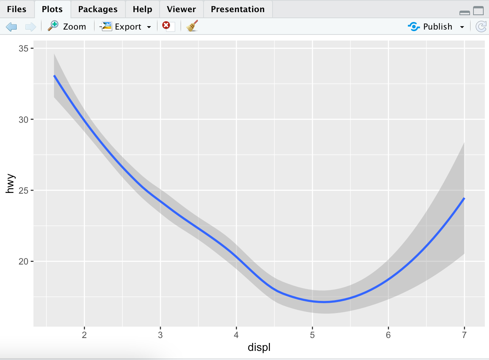
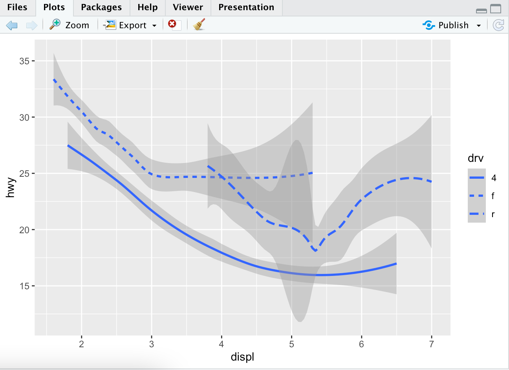
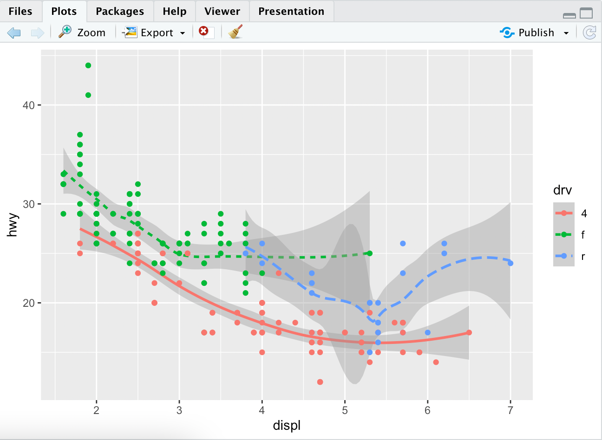
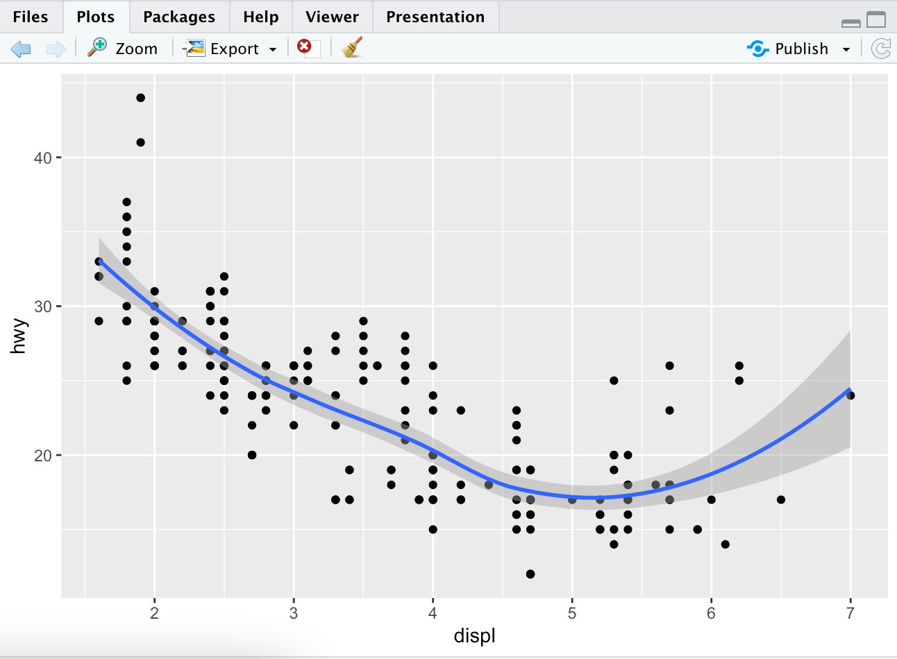
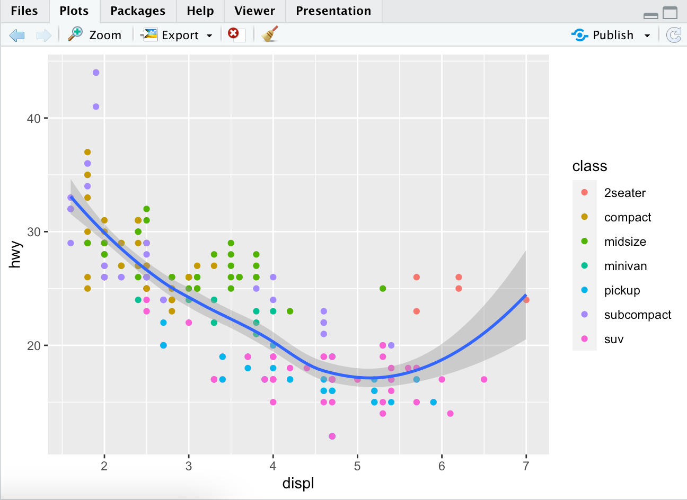
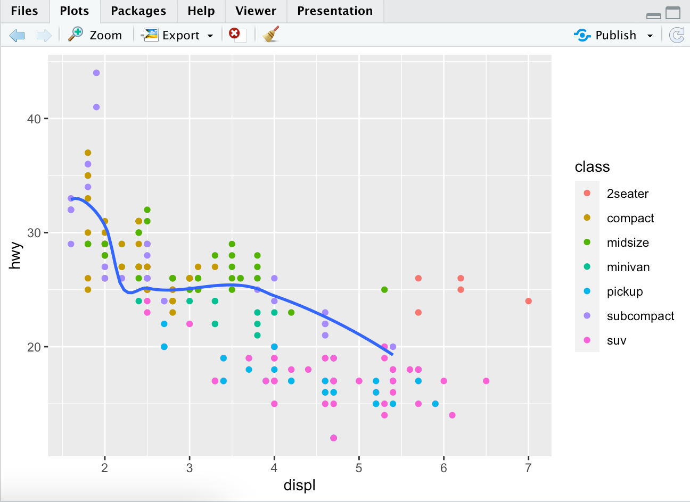

# Geometric Objects

A **geom** is the geometrical object that a plot uses to represent data. People often descibe plots by the type of geom that the plot uses. Bar charts use bar geoms, line charts use line geoms etc.

To change the geom in your plot, change the grom function that you added to the ggplot().

Try out:

```R
# left plot
ggplot(data=mpg) +
    geom_point(mapping = aes(x=displ, y=hwy))

# right plot
ggplot(data=mpg) +
    geom_smooth(mapping = aes(x=displ, y=hwy))

```

You will notice that the first graph looks the same as before, but the second graph looks a little different.



All geom functions in ggplot2 takes a `mapping` argument. However, not every aesthetic works with every geom. You can set the shape of a point, but you couldn't set the "shape" of the line. You can set the linetype of a line. `geom_smooth()` will draw a different line.

```R
ggplot(data=mpg) +
    geom_smooth(mapping = aes(x=displ, y=hwy, linetype=drv))
```



This separates the cars into three lines based on their `drv` value, which describes the drivetrain.

You can see how these lines look with the original data to get a better overall representation.

```R
> ggplot(data = mpg) +
     geom_smooth(mapping = aes(x = displ, y = hwy, linetype = drv, color = drv)) +
     geom_point(mapping = aes(x=displ, y=hwy, color = drv))
```



ggplot2 has over 40 geoms, and extension packages which can provide even more. The best way to get a comprehensive overview is a ggplot2 cheat sheet. I personally use: [this link](http://rstudio.com/resources/cheatsheets). You can also use ?geom_smooth while in R Studio and replace smooth with whatever you're curious about.

Here are some certain customizations that you can try out.

```R
ggplot(data = mpg) +
  geom_smooth(mapping = aes(x = displ, y = hwy))

ggplot(data = mpg) +
  geom_smooth(mapping = aes(x = displ, y = hwy, group = drv))

ggplot(data = mpg) +
  geom_smooth(
    mapping = aes(x = displ, y = hwy, color = drv),
    show.legend = FALSE
  )
```

To display multiple geoms on one plot yoou can just add them after you're done with one like this:

```R
ggplot(data = mpg) +
  geom_point(mapping = aes(x = displ, y = hwy)) +
  geom_smooth(mapping = aes(x = displ, y = hwy))
```



If you want to show the same data (both the same x and y variables), you can just specify the new plot you want to show. You do not need to say which ones are x and y vars each time.

```R
ggplot(data = mpg, mapping = aes(x = displ, y = hwy)) +
  geom_point() +
  geom_smooth()
```

If you are to place mappings in a geom function, ggplot2 treats them as local mappings for the layer. It will use these mappings to extend or overwrite the global mappings for ONLY THAT LAYER.

```R
ggplot(data = mpg, mapping = aes(x = displ, y = hwy)) +
  geom_point(mapping = aes(color = class)) +
  geom_smooth()
```

Now, only the point plot will have changed colors and not the smooth plot. The smooth plot will still use the global mapping.



This same idea can be used to specify different data for each later. In this example, the smooth line displays a subset of the mpg dataset. The local data argument in `geom_smooth()` overrides the global data argument in ggplot() for only that layer.

```R
ggplot(data = mpg, mapping = aes(x = displ, y = hwy)) +
  geom_point(mapping = aes(color = class)) +
  geom_smooth(data = filter(mpg, class == "subcompact"), se = FALSE)
```


